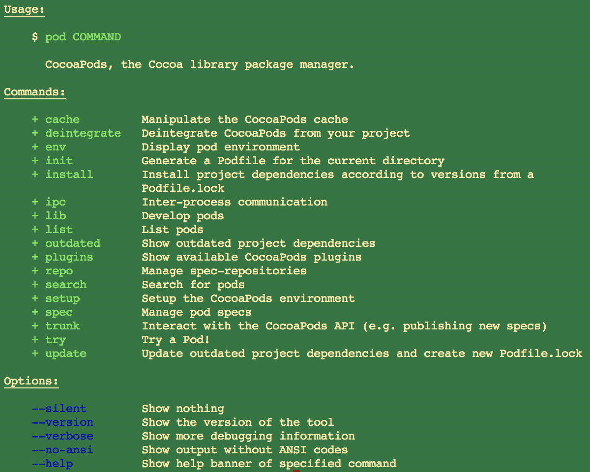
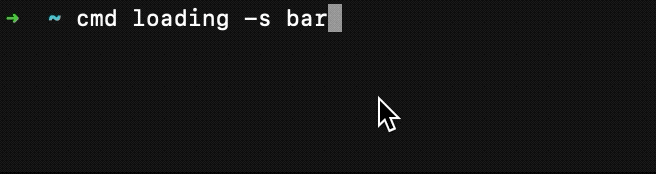
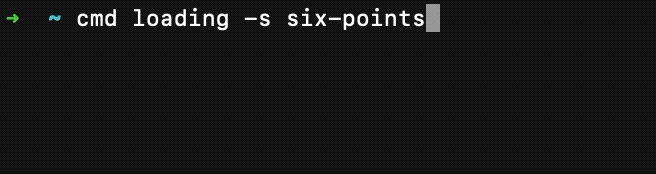
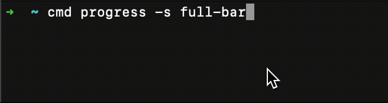
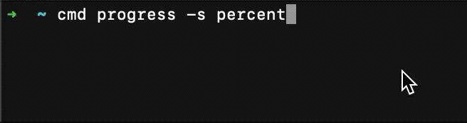

# CommandLine

[](https://cocoapods.org/pods/CommandLine)
[](https://cocoapods.org/pods/CommandLine)
[](https://cocoapods.org/pods/CommandLine)

A command line arguments parser of Objective-C

**SwiftyLine (CommandLine for Swift) is coming soon.**

## Demo

1. [Magic-Unique/MobileProvisionTool](https://github.com/Magic-Unique/MobileProvisionTool)

2. [Magic-Unique/IPAServer](https://github.com/Magic-Unique/IPAServer)

3. [Magic-Unique/IPASigner](https://github.com/Magic-Unique/IPASigner)

## Features

1. Support subcommands
2. Support forwarding subcommand
3. Support Queries
   * key-value (require)
   * key-value (optional)
   * key-value (optional & default-if-nil)
   * key-values (as array, for multi-queries)
4. Support Flags
5. Support Abbr and multi-abbrs parsing
6. Auto create colorful help infomation (just like cocoapods.)
7. Auto print helping infomation if arguments is invalid
8. Version command
9. Output with verbose/success/warning/error/info
10. Custom colorful text
11. Loading Indicator
12. Progress Bar

## Installation

### CocoaPods

```
pod 'CommandLine'
```

### Source

Drag ***CommandLine*** folder to your project.

### Import

```objc
#import "CommandLine.h"
```

## Usage

### Subcommand

If you want to define the command like:

```shell
$ pod spec create
```

it's meaning:

| binary | command | subcommand | subsubcommand... |
| ------ | ------- | ---------- | ---------------- |
| pod    | spec    | create     | ...              |

you can execute the code before parse.

```objc
@interface MyCommand_Spec : CLCommand @end 
@implementation MyCommand_Spec

command_configuration() {
  configuration.note = @"Create a pod spec";
}

command_main() {
  // do something to create a cocoapods spec.

  // return an int to main()
  return 0;
}
@end

@interface MyCommand_Pod : CLCommand @end
@implementation MyCommand_Pod
command_subcommands(MyCommand_Spec);
@end
  
int main(int argc, char **argv) {
  return [MyCommand_Pod main];
}
```

### Forwarding Subcommand

If you want to define default command like:

```shell
$ pod repo

# equals to

$ pod repo list
```

It's meaning:

| binary | command | forwarding subcommand |
| ------ | ------- | --------------------- |
| pod    | repo    | list                  |

You can execute the code before parse.

```objc
// Will support in feature.
```

### Queries

If you want to define the command like:

```shell
$ codesign [--entitlement /path/to/entitlement.plist] --cert "iPhone Developer: XXXX" ...
# or
$ codesign [-e /path/to/entitlement.plist] -c "iPhone Developer: XXXX" ...
```

It's meaning:

| Binary   | Query Key 1              | Query Value 1              | Query Key 2      | Query Value 2 |
|:--------:|:------------------------:|:--------------------------:|:----------------:|:-------------:|
| codesign | entitlement/e (optional) | /path/to/entitlement.plist | cert/c (require) | Cert Name     |

you can execute the code before parse.

```objective-c

@interface MyCommand_Codesign : CLCommand @end
@implementation MyCommand_Codesign

command_option(CLString, entitlement, shortName='e', nullable, note=@"Entitlement.plist path")
command_option(CLString, cert, shortName='c', nonnull, note=@"Cert name")
  
command_main() {
  // You can use getter or static variable to get argument
  NSString *_cert = [self cert]; // get value with getter.
  NSString *_entitlement = entitlement; // get value with variable
  // to code sign
  return EXIT_SUCCESS;
}

@end

int main(int argc, char **argv) {
  return [MyCommand_Codesign main];
}
```

If you want to get a array value like:

```shell
$ demo /path/to/input1 /path/to/input2
```

It's meaning:

| Binary | Query Key | Query Value |
| ------ | --------- | ----------- |
| demo   | input     | path array  |

you can execute the code before parse.

```objc
CLCommand *demo = [CLCommand main];
demo.setQuery(@"input").mutiable().require();
[demo handleProcess: ^CLResponse *(CLCommand *command, CLProcess *process) {
    NSArray *inputs = process.queries[@"input"];

    return EXIT_SUCCESS;
}];
```

### Flags

If you want to define the command like:

```shell
$ ls --all
# or
$ ls -a
```

It's meaning:

| Binary | Flag Key |
| ------ | -------- |
| ls     | all / a  |

you can execute the code before parse.

```objective-c
CLCommand *ls = [CLCommand main]; // get main command (without any command or subcommands)
ls.setFlag(@"all")
    .setAbbr('a')
    .setExplain(@"Print all contents."); // define a optional query
[ls handleProcess:^CLResponse *(CLCommand *command, CLProcess *process) {
    BOOL all = [process flag:@"all"];

    // list and print
    NSFileManager *fmgr = [NSFileManager defaultManager];
    NSError *error = nil;
    NSArray *contents = [fmgr contentsOfDirectory:[CLIOPath currentDirectory] error:&error];
    if (error) {
        printf("%s\n", error.localizedDescription.UTF8String);
        return [CLResponse error:error];
    }
    if (NO == all) {
        NSMutableArray *mContents = [NSMutableArray arrayWithArray:contents];
        //    remove all item with "." prefix in mContents;
        contents = [mContents copy];
    }
    for (NSString *item in contents) {
        printf("%s\n", item.UTF8String);
    }
    return EXIT_SUCCESS;
}];
```

### Abbr & Multi-abbrs

For example:

```shell
# Multi-abbrs for flags:

$ rm -rf /path/to/directory

# is meaning:

$ rm -r -f /path/to/directory
$ rm --recursive --force /path/to/directory

# 'r' is recursive(flag)'s abbr, 'f' is force(flag)'s abbr.
```

```shell
# Multi-abbrs for flags and a query

$ codesign -fs 'iPhone Developer: XXXX (XXXX)' /path/to/Application.app

# is meaning:

$ codesign -f -s 'iPhone Developer: XXXX (XXXX)' /path/to/Application.app

# 'f' is replacing-exist-sign(flag)'s abbr
# 's' is signature(query)'s abbr 
```

**CommandLine is supporting parse multi-abbrs!**

### IOPaths

IOPaths is a type of value without any key. It's usually used in input, output path. Such as:

```shel
$ cd /change/to/directory/        # inpuut
$ mkdir /create/new/folder        # input
$ zip /to/.zip /source/folder    # output & input
```

you can execute the code before parse.

```objc
CLCommand *zip = [CLCommand main]; // get main command (without any command or subcommands)

/*
    User must type in an output path and one or more input path(s)
*/
zip.addRequirePath(@"output")
    .setExplain(@"output key");
zip.addRequirePath(@"input1")
    .setExplain(@"Input path");
zip.addOptionalPath(@"input2")
    .setExplain(@"Input path");

[zip handleProcess:^CLResponse *(CLCommand *command, CLProcess *process) {
    NSArray *paths = process.paths; // paths.count >= 2
    NSString *output = paths.firstObject;
    NSArray *inputs = ({
        NSMutableArray *inputs = paths.mutableCopy;
        [input removeObjectAtIndex:0];
        inputs.copy;
    });

    NSString *fullOutput = [CLIOPath abslutePath:output]; // replace `~` with $HOME and append current directory if needs.
    //    to zip
    return EXIT_SUCCESS;
}];
```

### Parse

After you defined all commands and their subcommands, you can handle and process the arguments

```objc
CLCommandMain(); //    return [CLCommand handleProcess];
```

### Recommand Usage

**Frist**: Define all command in meta-class method with same prefix:

```objc
//    In a category.
+ (void)__init_command1 {
    // to define you command
}

//    In other category
+ (void)__init_command2 {
    //    to define you command
}
```

**Second**: Coding in main():

```objc
int main(int argc, const char * argv[]) {
    @autoreleasepool {
        CLMainExplain = @"Description for this command line tool"; // set description
        CLMakeSubcommand(CLCommand, __init_); // define your command. The second argument is the prefix in first step.
        CLCommandMain(); // handle and process arguments
    }
    return 0;
}
```

### Helping Infomations

When should the tool print helping infomation ?

1. User type in `--help` or `-h` for helping
2. User type in illegal arguments. Such as: inputed 2 paths but 3 required, didnot input required query...

**CommandLine** will auto create a colorfull helping infomation and print automatically.

**Colorfull helping infomation ?** Yes ! Just like *CocoaPods*.



### Special output

#### 1. Verbose

Print more infomations mode.

It will be triggered by flag `--verbose`. 

You can use in task:

```objective-c
CLVerbose(@"Making temp directory: %@", tempDirectory);
//    it will be print if the process contains `verbose` flag.
//    auto append a '\n' in end.
```

#### 2. Success

Print **green** text.

You can use in task:

```objc
CLSuccess(@"Done! There are %lu devices in the mobileprovision", devices.count);
//    devices is instance of NSArray
//    print the text render with green color
//    auto append a '\n' in end.
```

#### 3. Warning

Pring **yellow** text.

```objc
CLWarning(@"The directory is not exist, it will be ignore.");
//    print the text render with yellow color
//    auto append a '\n' in end.
```

#### 4. Error

Print **red** text.

You can use in task:

```objc
CLError(@"Error: %@", error);// error is instance of NSError
//    print the text render with red color
//    auto append a '\n' in end.
```

#### 5. More Info

Print **light** text.

You can use in task:

```objc
CLInfo(@"XXXXXX");
//    print the text with light font.
//    auto append a '\n' in end.
```

#### 6. --no-ansi flag

If user pass `--no-ansi` flag into arguments, all above function will print plain text.

#### 7. --silent flag

If use pass `--silent` flag into arguments, all above function will be invalid.

### Version

Print version of this tool or command.

```objc
[CLCommand mainCommand].version = @"1.0.0"; // do once.
```

```shell
$ tool --version
1.0.0

$ tool subcommand --version
1.2.0
```

### Terminal

```objc
NSString *fileList = CLLaunch(nil, @"ls", @"-a", nil);
CLLaunch(@"~", @"zip", @"-qry", @"output.zip", @".", nil);
CLLaunch(nil, @[@"ls", @"-a"], nil);
```

### Print colorful text

```objc
#import "CCText.h"
CCPrintf(CCStyleBord|CCStyleItalic, @"A text with %@ and %@", @"bord", @"italic");
// see more CCStyle in CCText.h
```

### Loading & Progress

```objc
CLLoading *loading = [CLLoading loading];
[loading start];
// do you task
[loading stop];
```




```objc
CLProgress *progress = [CLProgress progress];
[progress start];
// do you task and set progress between 0.0 ~ 1.0
progress.progress = 0.5;
[progress stop];
```




## LICENCE

MIT.